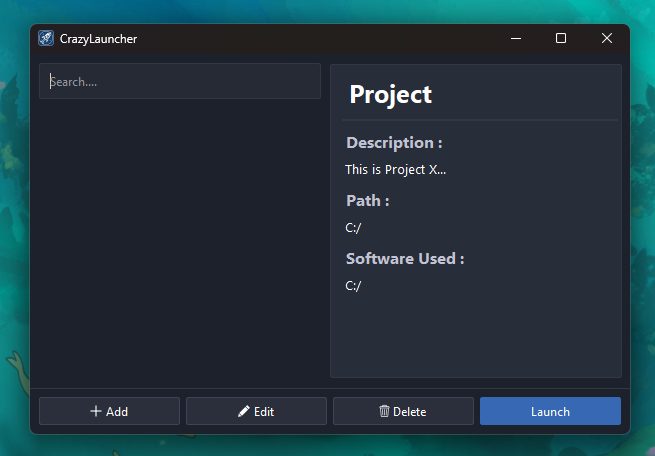
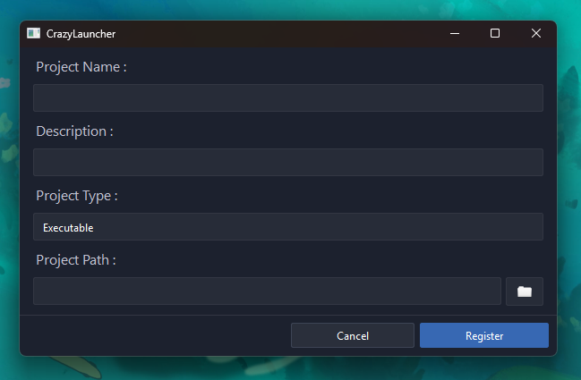
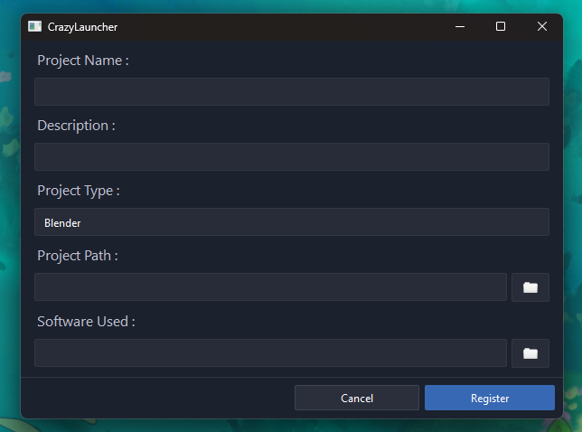

# 🚀 Crazy Launcher

**Crazy Launcher** est une application de bureau développée avec le framework **Qt** uniquement en C++, conçue pour centraliser et lancer facilement tous vos projets depuis un seul endroit.

---

## 🎯 Pourquoi ce projet ?

Ce projet est né d'une envie simple : **me créer une première expérience concrète avec Qt** et découvrir le workflow complet de développement d'une application desktop.

À travers Crazy Launcher, j'ai pu :
- Découvrir l'écosystème **Qt** et ses outils
- Créer un **installeur** avec CrazyInstaller
- Utiliser **Windeployqt** pour packager l'application
- Styliser l'interface avec du **QSS** (Qt Style Sheets)

En tant que programmeur passionné par de nombreux domaines, je voulais aussi un outil personnel qui me permette de **centraliser tous mes projets**, qu'ils soient des scripts, des executables, des projets Unreal, Unity et de les lancer en un clic. Je voulais aussi découvrir un peu plus l'applicatif.

---

## 📦 Installation

### Via CrazyInstaller

⚠️ Si votre Windows est en thème sombre la lisibilité de l'installeur sera peut-être réduite.

1. Téléchargez l'installeur : **[CrazyLauncherInstaller.exe](https://github.com/Sayaka-Shen/CrazyLauncher/releases/latest/download/CrazyLauncherInstaller.exe)**
2. Lancez l'exécutable et suivez les étapes de l'assistant d'installation
3. Choisissez le dossier de destination souhaité
4. C'est tout, l'application est prête à être utilisée ! ✅

### 🔧 Installation d'une nouvelle version

1. Désinstallez la version actuelle sur votre PC.
2. Suivez les étapes d'installation ci-dessus pour la nouvelle version. Le lien de l'installeur est mis à jour automatiquement avec la dernière version.

⚠️ Vous pouvez désinstaller la version actuellement installée sur votre PC sans craindre de perdre vos projets enregistrés.

---

## 🖥️ Utilisation

### Interface principale

L'interface vous présente tous vos projets ajoutés. Une **barre de recherche** en haut vous permet de retrouver rapidement un projet parmi tous ceux que vous avez enregistrés.

---

### ➕ Ajouter un projet

Pour ajouter un projet, cliquez sur le bouton d'ajout et renseignez les informations demandées : nom, description, chemin du fichier projet, et **type de projet**.

---

### ✏️ Modifier ou supprimer un projet

Depuis la liste de vos projets, vous pouvez à tout moment **modifier les informations** d'un projet existant ou le **supprimer** si vous n'en avez plus besoin.

---

### 🗂️ Types de projets supportés

Crazy Launcher gère plusieurs types de projets, chacun avec un comportement adapté au lancement :

- **Executable** — Le fichier `.exe` du projet. Aucun logiciel requis.
- **Script** — Le fichier source. Visual Studio ou Rider sera détecté automatiquement selon l'extension.
- **Unreal Engine** — Le fichier `.uproject`. Aucun logiciel requis.
- **Unity** — Le dossier du projet + l'`.exe` de la version Unity utilisée.
- **Blender** — Le fichier `.blend` + le Blender Launcher de la version utilisée.
- **Photoshop** — Le fichier `.psd` + l'`.exe` de Photoshop.
- **Custom** — N'importe quel fichier projet + le logiciel avec lequel l'ouvrir.

> **Pourquoi ces types ?**
> En tant que programmeur, j'ai d'abord géré les cas de développement (scripts, exécutables, moteurs de jeu), puis j'ai étendu le support à des outils très différents comme Blender ou Photoshop. Le type **Custom** est là pour couvrir tous les autres cas de figure, et vous laisser une liberté totale.

---

## ⚠️ Version bêta

Crazy Launcher est actuellement en **version bêta**. Il s'agit d'un projet de découverte et d'apprentissage; des bugs ou comportements inattendus peuvent donc apparaître à certains endroits.

N'hésitez pas à signaler tout problème rencontré, vos retours sont précieux pour améliorer l'application.

---

## 🙏 Remerciements

Merci à toutes les personnes qui prendront le temps de découvrir **Crazy Launcher** ! Ce projet représente beaucoup pour moi, c'est une première aventure dans le monde du développement applicatif, et je suis ravi de pouvoir le partager. J'espère qu'il pourra vous être utile, ou du moins, vous donner envie de créer le vôtre. 😊

